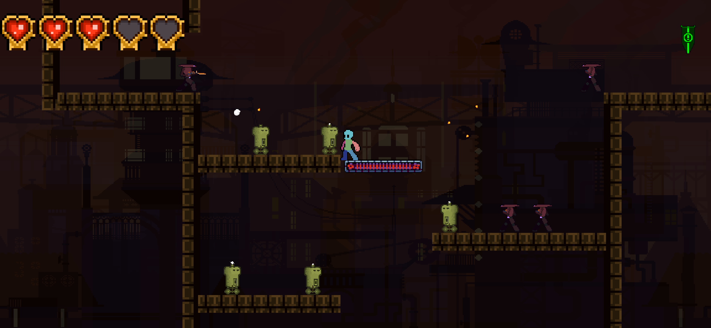
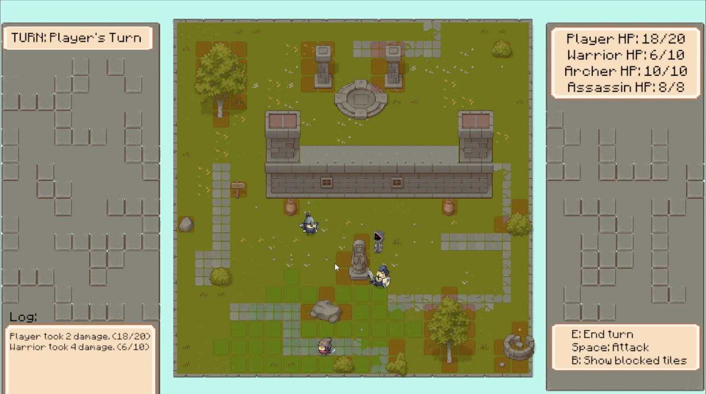
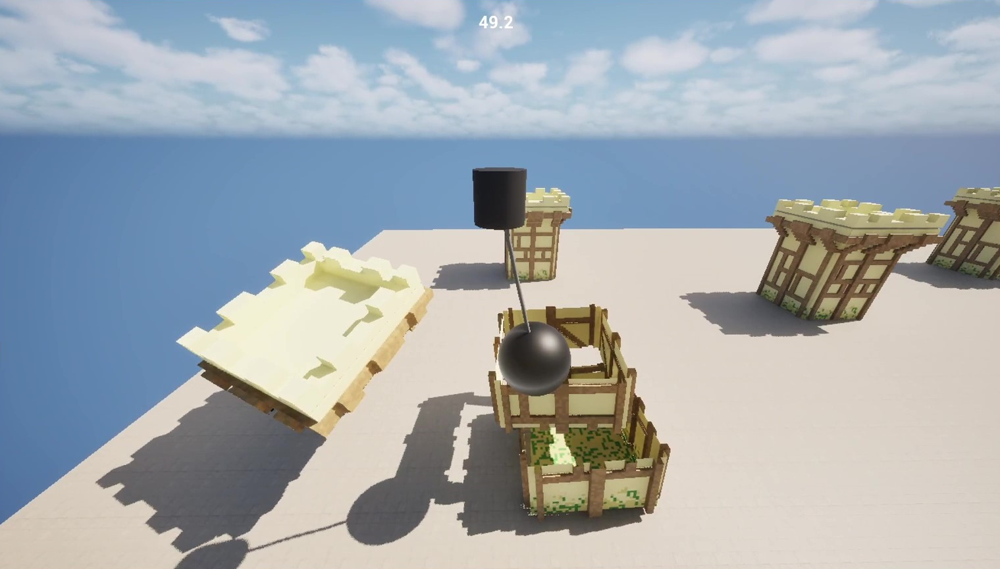
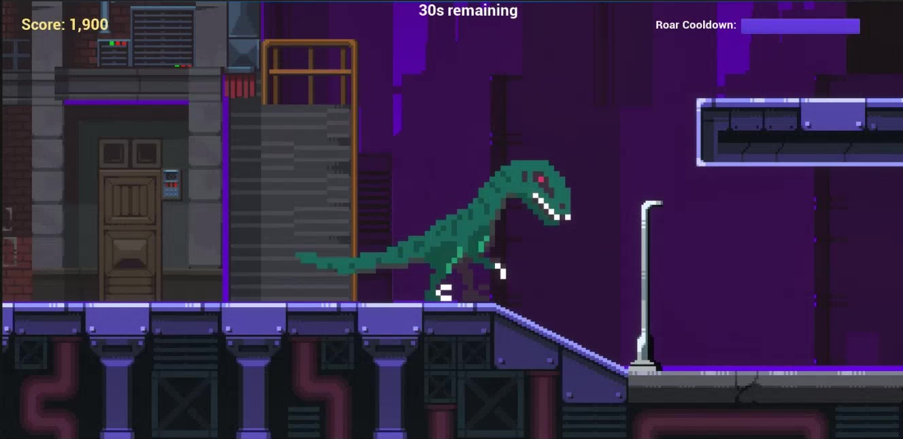
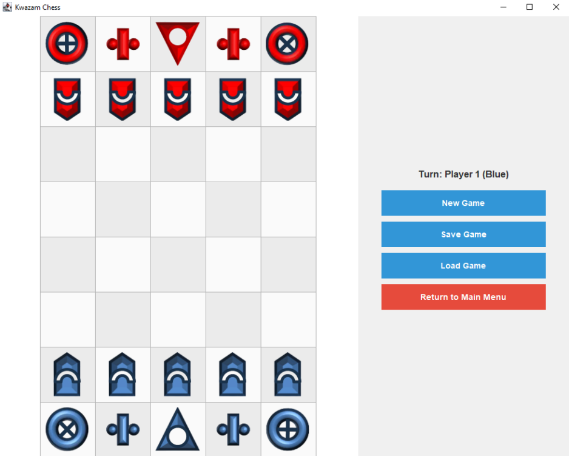
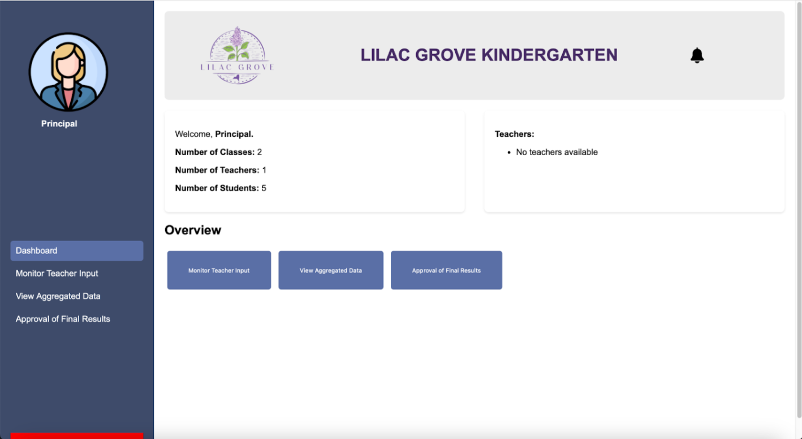

# Game Development Student | CS Undergrad
### Technical Skills: Python, C#, C++, Java, JavaScript, SQL
### Game Engines: Unity 6, Unreal Engine 5, Monogame, Pygame

## Education
- **Bachelor of Computer Science**, Multimedia University  
  _Aug 2023 – Aug 2026_  
  CGPA: 3.78/4.00  

- **Foundation in Information Technology**, Multimedia University  
  _Aug 2022 – Jul 2023_  
  CGPA: 3.55/4.00  

---

## Projects
### 🎮 Timeflow
A 2D puzzle-platformer built around a movement-based time-manipulation mechanic, where staying in motion stabilizes a safe "Past" state while hesitation triggers a hazardous "Future" state.

- **Tech Used**: Unity, C#
- **Role**: Solo Developer – designed and implemented the core mechanic, state system, and gameplay systems.
- **Highlights**: Hysteresis-based state transitions for smooth, non-jittery mechanic switching.

 

---

### 🎮 Pathbound — 2D Turn-Based Tactics Game
A grid-based tactics game where enemy units use a custom A* pathfinding system to navigate and engage the player in turn-based combat.

- **Tech Used**: Unity, C#
- **Role**: Solo Developer – built the pathfinding system, turn management architecture, and enemy AI.
- **Highlights**: 3 distinct enemy AI archetypes (melee, ranged kiter, and stealth assassin), each with unique targeting and positioning logic.

 

---

### 🎮 Wrecking Ball Blitz
A physics-based platformer where the player pilots a 5,000 kg wrecking ball to demolish physics-jointed structures before a timer runs out, relying entirely on real-world pendulum physics instead of pre-baked animation.

- **Tech Used**: Unreal Engine 5, Blueprint, Chaos Physics
- **Role**: Solo Developer – built ball/cable physics, breakable joint-based structures, and dynamic building spawning.
- **Highlights**: True pendulum-driven momentum system and buildings assembled from constraint-jointed mesh pieces with configurable break thresholds.

 

---

### 🎮 Raptor Rampage
A 2D side-scrolling destruction game built with Paper2D, where a player-controlled raptor demolishes a cyberpunk city's props using melee and AoE shockwave attacks before time runs out.

- **Tech Used**: Unreal Engine 5, Paper2D, Blueprint, Niagara
- **Role**: Solo Developer – built combat system, prop health/destruction logic, and game loop tracking.
- **Highlights**: Box/sphere trace-based combat, combo scoring system, and Niagara-driven destruction VFX.

 

---

### 🎮 Blackout — Urban Survival Stealth Game
A first-person stealth escape game set in a multi-storey building during a city-wide blackout, where players must sneak past armed looters using light and shadow to find a way out.

- **Tech Used**: Unity, C#, NavMesh
- **Role**: Team of 2 – built player movement (Rigidbody-based), first-person camera look, flashlight/battery system, input handling, and physics layer setup.
- **Highlights**: Detection-based stealth loop where flashlight use creates risk vs. visibility trade-off; Raycast-driven item interaction system.

 

---

### 🎮 Kwazam Chess
A turn-based Java chess game implementing OOP principles and design patterns such as **MVC**, **Observer**, **Facade**, and **Singleton**. The game features dynamic piece transformation and state-saving mechanics.

- **Tech Used**: Java
- **Role**: Core Developer – implemented architecture, game logic, and UI.
- **Highlights**: Strong focus on maintainable code using object-oriented design.

 

---

### 🧮 Lilac Grove Kindergarten Assessment Tracker
A web app for kindergarten staff and parents to track academic progress and communicate more efficiently.

- **Tech Used**: Python, Django, HTML, CSS, JavaScript, SQLite
- **Role**: Full-stack Developer – built backend logic and frontend UI.
- **Highlights**: CRUD operations, user-friendly design, real-time updates between staff and parents.

  

---

## 💬 Contact
- 📧 Email: [amirmuqrie@gmail.com](mailto:amirmuqrie@gmail.com)  
- 💼 LinkedIn: [linkedin.com/in/amir-muqrie-salehodin-371458286](https://www.linkedin.com/in/amir-muqrie-salehodin-371458286)  
- 🧑‍💻 GitHub: [github.com/BuddyOdin](https://github.com/BuddyOdin)

---

_Last updated Sep 2026_

