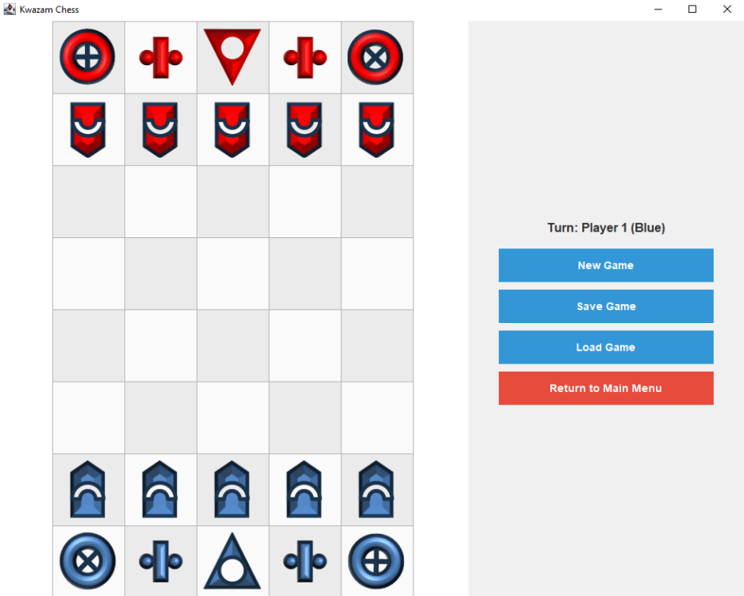

# Game Development Student | CS Undergrad
### Technical Skills: Python, C++, Java, JavaScript, SQL

## Education
- **Bachelor of Computer Science**, Multimedia University  
  _Aug 2023 – Aug 2026 (Expected)_  
  CGPA: 3.43/4.00  

- **Foundation in Information Technology**, Multimedia University  
  _Aug 2022 – Jul 2023_  
  CGPA: 3.55/4.00  

---

## Projects

### 🎮 Kwazam Chess
A turn-based Java chess game implementing OOP principles and design patterns such as **MVC**, **Observer**, **Facade**, and **Singleton**. The game features dynamic piece transformation and state-saving mechanics.

- **Tech Used**: Java
- **Role**: Core Developer – implemented architecture, game logic, and UI.
- **Highlights**: Strong focus on maintainable code using object-oriented design.

 

---

### 🧮 Lilac Grove Kindergarten Assessment Tracker
A web app for kindergarten staff and parents to track academic progress and communicate more efficiently.

- **Tech Used**: Python, Django, HTML, CSS, JavaScript, SQLite
- **Role**: Full-stack Developer – built backend logic and frontend UI.
- **Highlights**: CRUD operations, user-friendly design, real-time updates between staff and parents.

  

---

### ⏱️ CPU Scheduler
A visual CPU scheduling web app that displays the flow of scheduling algorithms.

- **Tech Used**: Java
- **Role**: Developer – built the flow simulation and UI interactions.
- **Highlights**: Helps visualize complex CPU scheduling logic through an interactive interface.

  

---

### 🐤 Duck Shooter
A 2D precision-based shooting game where players must hit moving targets and ducks.

- **Tech Used**: GDevelop
- **Role**: Solo Developer – designed and implemented core gameplay systems.
- **Highlights**:  Shows control over gameplay loops and UI design

 

